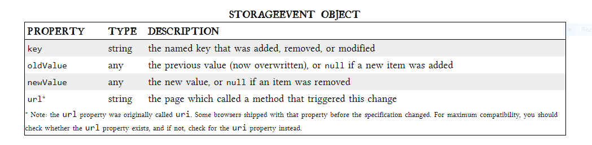

# Read: 13 - Local Storage

## “The Past, Present, and Future of Local Storage for Web Applications”

- Check for HTML5 Storage

```
function supports_html5_storage() {
  try {
    return 'localStorage' in window && window['localStorage'] !== null;
  } catch (e) {
    return false;
  }
}
```

- HTML5 Storage is based on named key/value pairs
  - Store data based on a named key, then you can retrieve that data with the same key
    - Named key is a string



- Limitations of the now-standardized HTML5 Storage
  - 5 megabytes
    - How much storage space each origin gets by default
  - QUOTA_EXCEEDED_ERR
    - The exception that will get thrown if you exceed your storage quota of 5 megabytes
  - No
    - Answer to the next obvious question, “Can I ask the user for more storage space?”
- Data is stored as strings. If you are storing something other than a string, you’ll need to coerce it yourself when you retrieve it.
- SQL enters the scene as a powerful database tool. 

[Back to README](README.md)